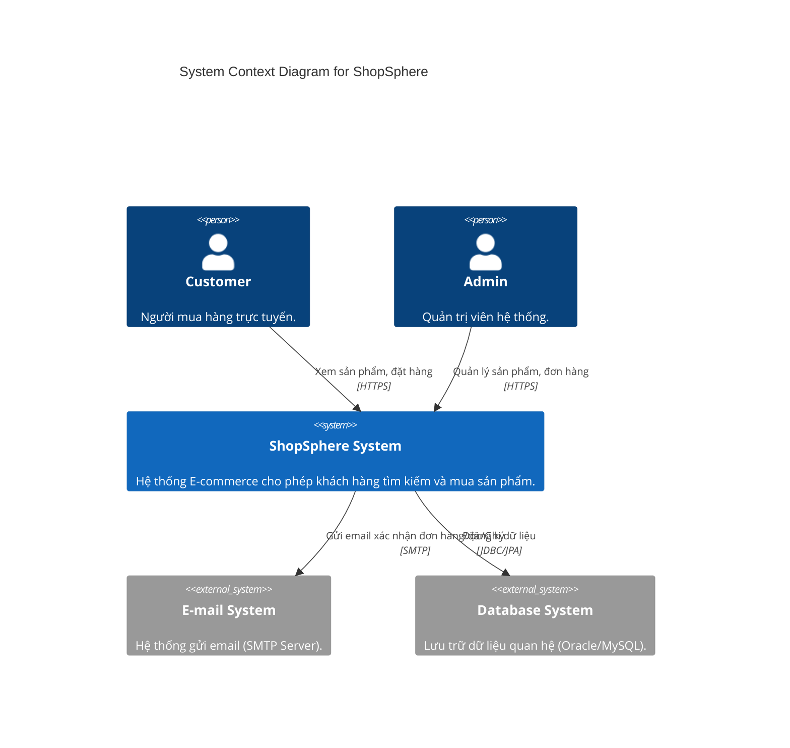
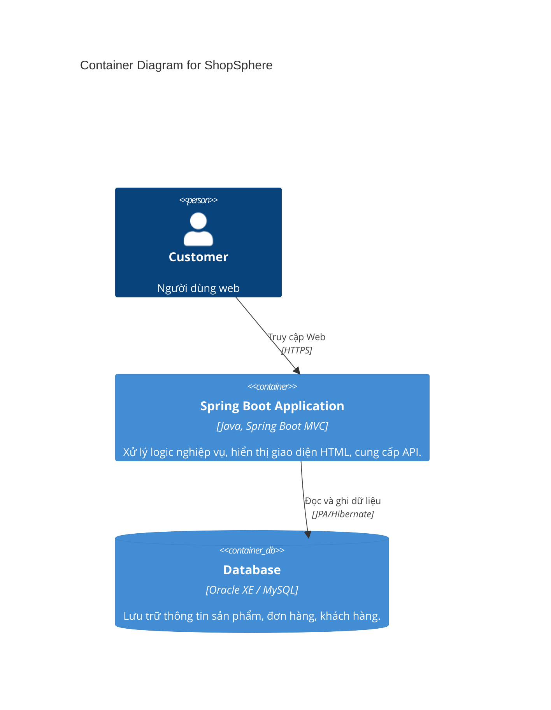
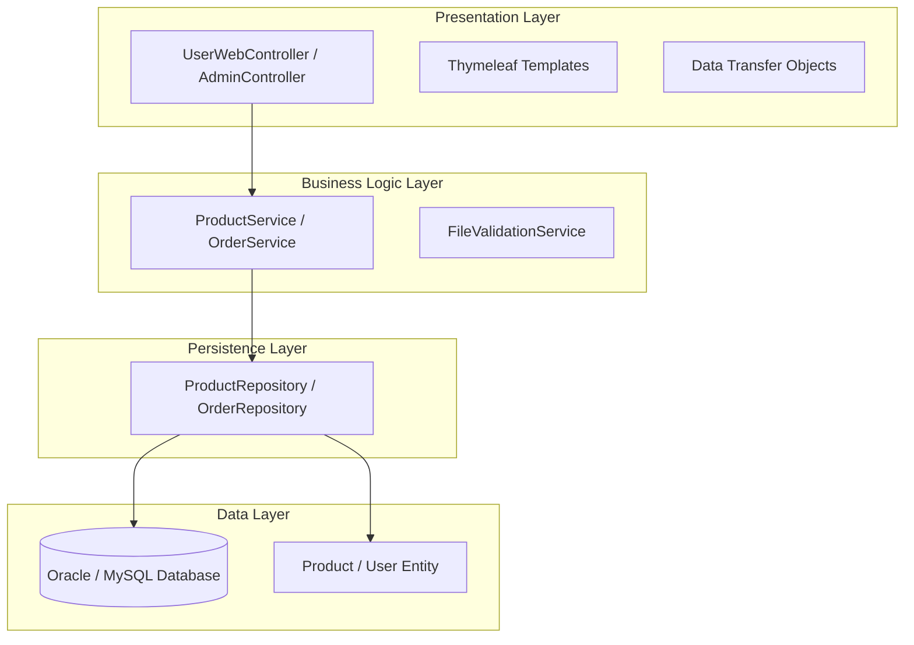

# Báo Cáo Lab 2: Software Architecture Analysis - ShopSphere

## 1. Introduction

### Mục tiêu của Lab 2
Mục tiêu chính của bài Lab 2 là phân tích và thiết kế kiến trúc phần mềm cho hệ thống E-commerce **ShopSphere**. Bài báo cáo tập trung vào việc áp dụng **Layered Architecture** (Kiến trúc phân lớp) kết hợp với mẫu thiết kế **MVC** (Model-View-Controller) trong Spring Boot để đảm bảo tính module hóa, dễ bảo trì và mở rộng.

### Phạm vi bài lab
Phạm vi bao gồm việc xác định và mô tả chi tiết 4 tầng kiến trúc: **Presentation Layer**, **Business Logic Layer**, **Persistence Layer**, và **Data Layer**. Bài báo cáo cũng đi sâu vào phân tích luồng dữ liệu (Data Flow), xác định các component chính cho module **Product Catalog**, và định nghĩa các interface giao tiếp giữa các tầng.

### Giới thiệu ngắn về hệ thống ShopSphere
**ShopSphere** là một hệ thống thương mại điện tử (E-commerce web application) được xây dựng trên nền tảng **Spring Boot**. Hệ thống cung cấp các chức năng chính như:
-   **Khách hàng (User)**: Xem danh sách sản phẩm, chi tiết sản phẩm, đặt hàng, đăng ký/đăng nhập.
-   **Quản trị viên (Admin)**: Quản lý sản phẩm (CRUD), quản lý danh mục, xem đơn hàng, quản lý người dùng.
Hệ thống sử dụng cơ sở dữ liệu quan hệ (Oracle XE / MySQL) để lưu trữ dữ liệu bền vững.

---

## 2. Architectural Overview

### Kiến trúc tổng thể
Hệ thống sử dụng **Layered Architecture** với 4 tầng chính, kết hợp mô hình **C4** để mô tả hệ thống ở các mức độ trừu tượng khác nhau.

### Use Case Diagram
Sơ đồ Use Case tổng quát cho hai tác nhân chính: Khách hàng (Customer) và Quản trị viên (Admin).

```mermaid
usecaseDiagram
    actor "Khách hàng (Customer)" as User
    actor "Quản trị viên (Admin)" as Admin

    package "ShopSphere System" {
        usecase "Đăng ký / Đăng nhập" as UC1
        usecase "Xem danh sách sản phẩm" as UC2
        usecase "Tìm kiếm sản phẩm" as UC3
        usecase "Xem chi tiết sản phẩm" as UC4
        usecase "Thêm vào giỏ hàng" as UC5
        usecase "Đặt hàng (Checkout)" as UC6
        usecase "Quản lý đơn hàng cá nhân" as UC7
        
        usecase "Quản lý sản phẩm (CRUD)" as UC_Admin1
        usecase "Quản lý danh mục" as UC_Admin2
        usecase "Quản lý đơn hàng hệ thống" as UC_Admin3
        usecase "Quản lý người dùng" as UC_Admin4
    }

    User --> UC1
    User --> UC2
    User --> UC3
    User --> UC4
    User --> UC5
    User --> UC6
    User --> UC7

    Admin --> UC1
    Admin --> UC_Admin1
    Admin --> UC_Admin2
    Admin --> UC_Admin3
    Admin --> UC_Admin4
```

### C4 Model - Level 1: System Context
Mô tả hệ thống ShopSphere trong bối cảnh tương tác với người dùng và các hệ thống bên ngoài (nếu có, ví dụ Email System).



### C4 Model - Level 2: Container Diagram
Chi tiết hóa hệ thống thành các Container (Web App, Database).



---

## 3. Layered Architecture Design

### 3.1. Overview of the Four Layers

Hệ thống được tổ chức thành 4 tầng giao tiếp theo chiều dọc (Top-Down):

1.  **Presentation Layer**: `com.bkap.controller`
2.  **Business Logic Layer**: `com.bkap.services`
3.  **Persistence Layer**: `com.bkap.repository`
4.  **Data Layer**: Database & Entities (`com.bkap.entity`)

**Sơ đồ Kiến trúc Phân lớp (Layered Architecture Diagram)**



### 3.2. Presentation Layer (MVC)
-   **Vai trò**: Tiếp nhận request HTTP, validate input cơ bản, gọi Business Layer.
-   **Các thành phần chính**:
    -   **Controller**: `ProductController` (Admin), `UserWebController` (User).
    -   **View**: Các file HTML trong `resources/templates/admin/product` hoặc `templates/user`.
    -   **Thao tác**: Nhận tham số từ form (`@ModelAttribute`, `@RequestParam`), validate file upload, xử lý hiển thị model.

### 3.3. Business Logic Layer
-   **Vai trò**: Xử lý logic nghiệp vụ cốt lõi. Chỉ chứa logic, không chứa code giao diện.
-   **Thao tác**:
    -   Kiểm tra logic nghiệp vụ (vd: logic tìm kiếm phức tạp).
    -   Giao tiếp với Repository để lấy dữ liệu thô và chuyển đổi sang DTO nếu cần.
    -   Quản lý transaction (`@Transactional`).

### 3.4. Persistence Layer
-   **Vai trò**: Giao tiếp trực tiếp với database thông qua Spring Data JPA.
-   **Thao tác**:
    -   Cung cấp các hàm CRUD cơ bản (`save`, `delete`, `findById`).
    -   Định nghĩa các câu truy vấn tùy chỉnh (`findByCategory_NameIgnoreCase`).

### 3.5. Data Layer
-   **Entity**: Các class Java map 1-1 với bảng trong DB (`@Entity`, `@Table`).
-   **Database**: Nơi lưu trữ vật lý.

---

## 4. Data Flow Description

### Mô tả luồng xử lý
Luồng dữ liệu đi từ **Presentation** -> **Business** -> **Persistence** -> **Data** và trả kết quả ngược lại.

### C4 Model - Level 3: Component Diagram (Use Case: View Product Details)
Minh họa luồng xử lý chi tiết cho chức năng xem và quản lý sản phẩm.

```mermaid
C4Component
    title Component Diagram - Product Catalog Module

    Container(webApp, "ShopSphere Web App", "Spring Boot") {
        Component(adminController, "ProductController", "Spring MVC Controller", "Nhận request thêm/sửa/xóa sản phẩm.")
        Component(productService, "ProductServiceImpl", "Spring Service", "Xử lý nghiệp vụ sản phẩm, tìm kiếm, validate.")
        Component(productRepo, "ProductRepository", "Spring Data Interface", "Truy vấn dữ liệu từ DB, CRUD.")
        Component(productEntity, "Product Entity", "JPA Entity", "Ánh xạ bảng 'products'.")
    }

    ContainerDb(db, "Database", "Oracle/MySQL", "Lưu trữ dữ liệu.")

    Rel(adminController, productService, "Calls Interface")
    Rel(productService, productRepo, "Calls Interface")
    Rel(productRepo, productEntity, "Maniupulates")
    Rel(productRepo, db, "SQL Queries", "JPA")
```

---

## 5. Component Identification – Product Catalog

Chi tiết các component trong mã nguồn:

### 5.1. Components in Presentation Layer
| Component | Class Name | Chức năng |
| :--- | :--- | :--- |
| **Admin Product Controller** | `com.bkap.controller.admin.ProductController` | Xử lý các route `/admin/product/**`: List, Add, Edit, Delete. |
| **User Web Controller** | `com.bkap.controller.UserWebController` | Xử lý hiển thị sản phẩm ở trang chủ, trang danh mục cho user. |

### 5.2. Components in Business Logic Layer
| Component | Class Name | Chức năng |
| :--- | :--- | :--- |
| **Product Service Interface** | `com.bkap.services.ProductService` | Interface định nghĩa các hành vi nghiệp vụ. |
| **Product Service Implementation** | `com.bkap.services.ProductServiceImpl` | Cài đặt logic: tìm kiếm theo tên, lọc theo brand, phân trang. |

### 5.3. Components in Persistence Layer
| Component | Interaction | Chức năng |
| :--- | :--- | :--- |
| **Product Repository** | `com.bkap.repository.ProductRepository` | Kế thừa `JpaRepository`. Custom queries: `findTop3LatestLaptops`, `searchByNameOrCategory`. |

---

## 6. Interface Definition

Các interface giúp tách biệt các tầng:

### 6.1. Interface Presentation -> Business
**`ProductService`**:
-   `Optional<Product> findById(long id);`
-   `Boolean create(Product product);`
-   `Page<Product> findAll(Integer pageNo);`

### 6.2. Interface Business -> Persistence
**`ProductRepository`**:
-   `List<Product> findAll();`
-   `List<Product> findByCategory_NameIgnoreCase(String name);`

---

## 7. Conclusion

Thiết kế đã tuân thủ nghiêm ngặt **Layered Architecture** và **MVC**. Việc sử dụng **Spring Boot** cùng các pattern này giúp hệ thống ShopSphere:
1.  **Dễ bảo trì**: Code được tổ chức rõ ràng theo chức năng.
2.  **Dễ mở rộng**: Có thể thêm các module mới (Payment, Shipping) mà ít ảnh hưởng đến module cũ.
3.  **Chuẩn hóa**: Tuân theo các tiêu chuẩn công nghiệp về kiến trúc phần mềm (C4 Model).

Tài liệu này phục vụ làm cơ sở cho việc triển khai (Implementation) trong Lab 3.
