# 📋 Tài Liệu Kiến Trúc Phần Mềm - ShopSphere E-Commerce Platform

**Phiên bản:** 1.0  
**Ngày tạo:** 05/02/2026  
**Tác giả:** Software Architecture Team  
**Dự án:** ShopSphere E-Commerce System  

---

## 📑 Mục Lục

1. [Giới thiệu](#1-giới-thiệu)
2. [Tổng quan hệ thống](#2-tổng-quan-hệ-thống)
3. [Yêu cầu kiến trúc](#3-yêu-cầu-kiến-trúc)
4. [Quyết định kiến trúc](#4-quyết-định-kiến-trúc)
5. [Kiến trúc hệ thống](#5-kiến-trúc-hệ-thống)
6. [Kết luận](#6-kết-luận)

---

## 1. Giới thiệu

### 1.1. Mục đích tài liệu
Tài liệu này mô tả chi tiết kiến trúc phần mềm của hệ thống ShopSphere E-Commerce Platform, bao gồm các quyết định thiết kế, mô hình kiến trúc, và cách thức triển khai các thành phần hệ thống.

### 1.2. Phạm vi áp dụng
- Đội ngũ phát triển phần mềm
- Kiến trúc sư phần mềm
- Quản lý dự án
- Đội ngũ vận hành hệ thống

### 1.3. Định nghĩa và thuật ngữ
- **ASR**: Architecturally Significant Requirements
- **MVC**: Model-View-Controller
- **JPA**: Java Persistence API
- **DTO**: Data Transfer Object
- **CRUD**: Create, Read, Update, Delete

---

## 2. Tổng quan hệ thống

### 2.1. Mô tả hệ thống
ShopSphere là một nền tảng thương mại điện tử toàn diện, cho phép khách hàng duyệt, tìm kiếm và mua các sản phẩm công nghệ như laptop, smartphone, camera và phụ kiện.

### 2.2. Stakeholders chính
- **Khách hàng**: Người dùng cuối mua sắm trực tuyến
- **Quản trị viên**: Quản lý sản phẩm, đơn hàng, người dùng
- **Nhà phát triển**: Xây dựng và bảo trì hệ thống
- **Quản lý vận hành**: Giám sát và vận hành hệ thống

---
## 3. Yêu cầu kiến trúc

### 3.1. Yêu cầu chức năng chính
- **Quản lý người dùng**: Đăng ký, đăng nhập, phân quyền
- **Quản lý sản phẩm**: CRUD sản phẩm, danh mục, tìm kiếm
- **Quản lý giỏ hàng**: Thêm, sửa, xóa sản phẩm trong giỏ
- **Quản lý đơn hàng**: Tạo đơn, theo dõi trạng thái
- **Quản lý thanh toán**: Xử lý thanh toán, xác nhận giao dịch

### 3.2. Yêu cầu phi chức năng (ASR)
- **Performance**: Thời gian phản hồi < 2s cho 95% requests
- **Scalability**: Hỗ trợ 1000+ concurrent users
- **Security**: Bảo mật dữ liệu người dùng và giao dịch
- **Maintainability**: Code dễ bảo trì và mở rộng
- **Availability**: Uptime 99.5%
- **Usability**: Giao diện thân thiện, responsive

---

## 4. Quyết định kiến trúc

### 4.1. Lựa chọn phong cách kiến trúc

#### 4.1.1. Monolithic vs Microservices
**Quyết định**: Chọn **Monolithic Architecture**

**Lý do**:
- Đội ngũ phát triển nhỏ (< 10 người)
- Yêu cầu triển khai nhanh
- Độ phức tạp nghiệp vụ vừa phải
- Chi phí vận hành thấp
- Dễ debug và testing

#### 4.1.2. Layered Architecture
**Quyết định**: Áp dụng **4-Layer Architecture**

**Lý do**:
- Separation of concerns rõ ràng
- Dễ bảo trì và mở rộng
- Tái sử dụng code cao
- Phù hợp với Spring Boot framework

### 4.2. Lựa chọn công nghệ

#### 4.2.1. Backend Framework
**Quyết định**: Spring Boot 3.5.0

**Lý do**:
- Ecosystem phong phú
- Auto-configuration
- Production-ready features
- Community support mạnh

#### 4.2.2. Database
**Quyết định**: Oracle Database XE

**Lý do**:
- ACID compliance
- Mature và stable
- Enterprise features
- Phù hợp với yêu cầu dự án

#### 4.2.3. Frontend Technology
**Quyết định**: Server-side rendering với Thymeleaf

**Lý do**:
- SEO friendly
- Tích hợp tốt với Spring Boot
- Đơn giản hóa deployment
- Phù hợp với team backend

---
## 5. Kiến trúc hệ thống (Architectural Design & Implementation)

### 5.1. Tổng quan kiến trúc hệ thống

#### 5.1.1. Mục tiêu thiết kế kiến trúc
- **Modularity**: Phân chia hệ thống thành các module độc lập
- **Maintainability**: Dễ bảo trì và mở rộng tính năng
- **Testability**: Hỗ trợ unit testing và integration testing
- **Reusability**: Tái sử dụng code và component
- **Scalability**: Có thể mở rộng theo chiều ngang và dọc

#### 5.1.2. Các ràng buộc kiến trúc (Constraints)
- **Technology Stack**: Java 17, Spring Boot 3.x
- **Database**: Oracle Database XE
- **Deployment**: Single server deployment
- **Security**: Spring Security framework
- **Performance**: Response time < 2s
- **Browser Support**: Chrome, Firefox, Safari, Edge

#### 5.1.3. Phong cách kiến trúc được lựa chọn

**Monolithic Architecture với Layered Pattern**

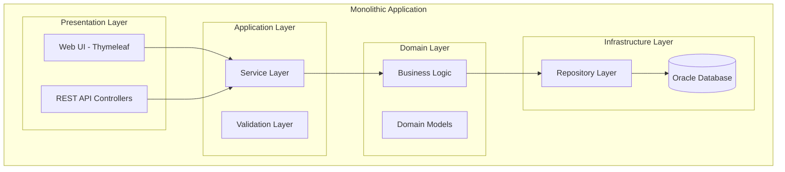

**Layered Architecture**
- **4-tier architecture** với strict layering
- Mỗi layer chỉ giao tiếp với layer ngay bên dưới
- Dependency injection để loose coupling

#### 5.1.4. Sơ đồ kiến trúc tổng thể hệ thống

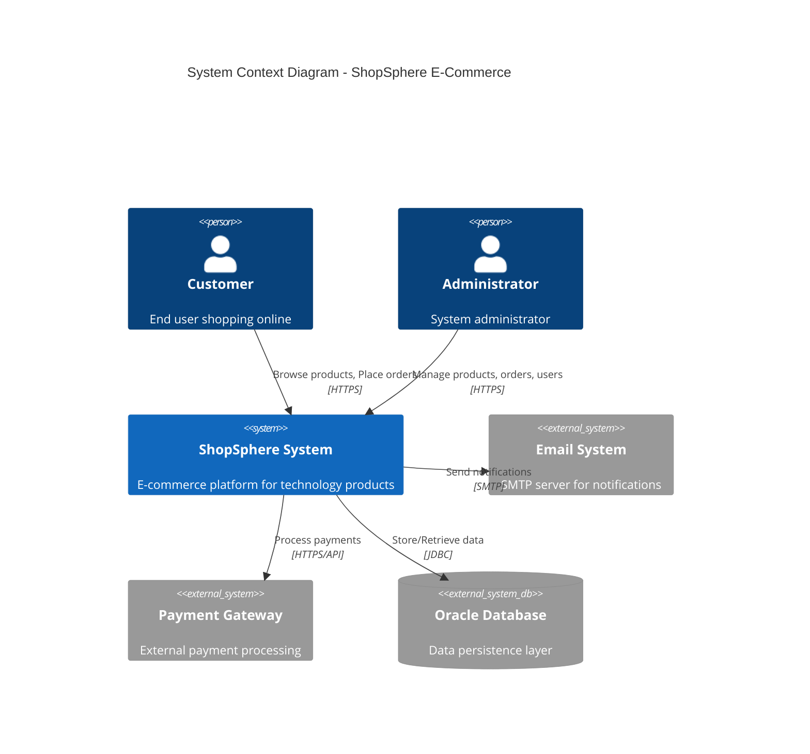

#### 5.1.5. Mô tả luồng xử lý tổng quát

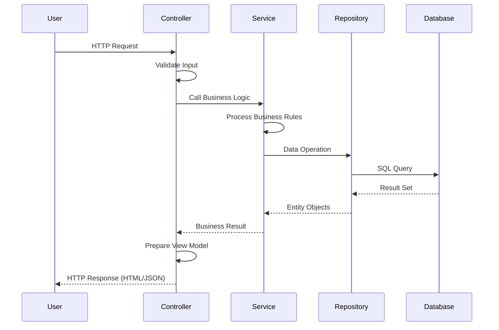

### 5.2. Kiến trúc phân tầng (Layered Architecture)

#### 5.2.1. Tổng quan mô hình phân tầng

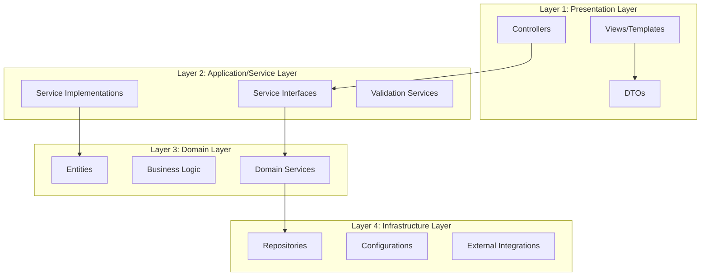

#### 5.2.2. Presentation Layer

**Chức năng:**
- Tiếp nhận HTTP requests từ client
- Validate input parameters
- Điều hướng đến business logic
- Render response (HTML/JSON)

**Thành phần chính:**

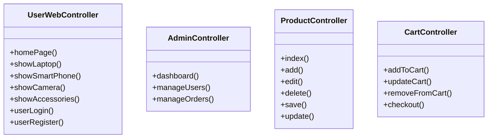

**Package Structure:**
- `com.bkap.controller` - Web controllers
- `com.bkap.controller.admin` - Admin controllers
- `com.bkap.api` - REST API controllers
- `com.bkap.dto` - Data Transfer Objects

#### 5.2.3. Application / Service Layer

**Vai trò xử lý nghiệp vụ:**
- Orchestrate business workflows
- Transaction management
- Business rule validation
- Cross-cutting concerns (logging, security)

**Điều phối luồng xử lý:**

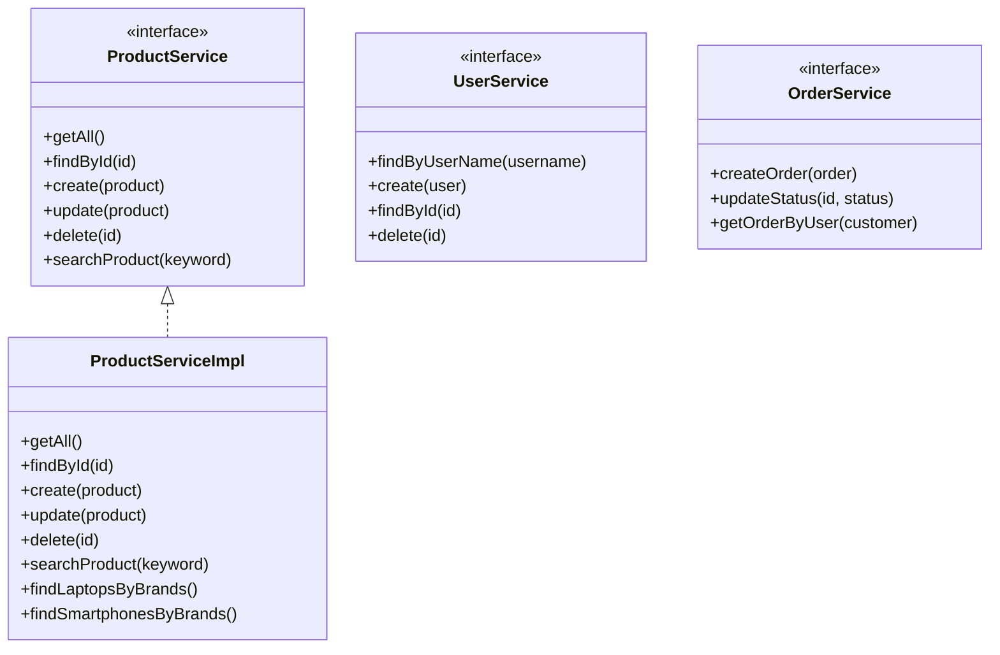

#### 5.2.4. Domain Layer

**Business Logic:**
- Core business rules
- Domain-specific calculations
- Entity behavior
- Domain events

**Domain Models:**

```mermaid
classDiagram
    class Product {
        -Long id
        -String name
        -Double price
        -String brand
        -String description
        -Category category
        +validatePrice()
        +isAvailable()
    }
    
    class Category {
        -Integer id
        -String name
        -Boolean status
        -String image
        +isActive()
    }
    
    class User {
        -Long id
        -String username
        -String email
        -String password
        -String role
        -Boolean enabled
        +isAdmin()
        +isEnabled()
    }
    
    class Orders {
        -Long id
        -Customer customer
        -LocalDateTime created
        -Integer status
        +calculateTotal()
        +canCancel()
    }
    
    Product }o-- Category
    User ||--|| Customer
    Customer ||--o{ Orders
```

#### 5.2.5. Infrastructure / Data Access Layer

**Truy cập cơ sở dữ liệu:**
- JPA/Hibernate ORM
- Repository pattern
- Query optimization
- Transaction management

**Tích hợp hệ thống bên ngoài:**
- Email service integration
- File storage service
- External APIs

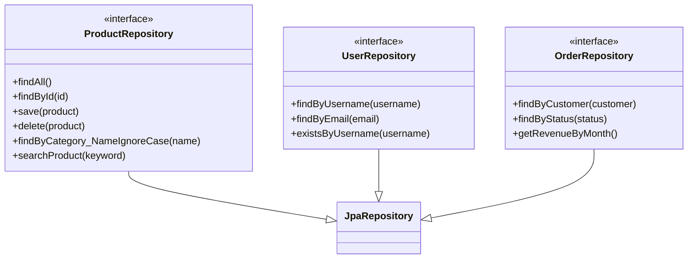

### 5.3. Phân rã hệ thống thành các Module

#### 5.3.1. Nguyên tắc phân rã module
- **Single Responsibility**: Mỗi module có một trách nhiệm duy nhất
- **High Cohesion**: Các thành phần trong module liên quan chặt chẽ
- **Low Coupling**: Giảm thiểu phụ thuộc giữa các module
- **Interface Segregation**: Sử dụng interface để tách biệt implementation

#### 5.3.2. Sơ đồ module tổng thể

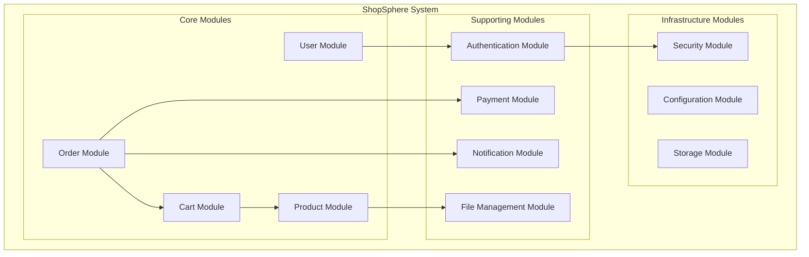

#### 5.3.3. Module User

**Chức năng chính:**
- Quản lý thông tin người dùng
- Đăng ký/Đăng nhập
- Phân quyền người dùng
- Quản lý profile

**Trách nhiệm:**
- User registration và authentication
- User profile management
- Role-based access control
- Password management

**Các thành phần nội bộ:**

```mermaid
classDiagram
    class UserController {
        +userLogin()
        +userRegister()
        +showProfile()
        +updateProfile()
    }
    
    class UserService {
        +findByUserName()
        +create()
        +update()
        +changePassword()
    }
    
    class User {
        -Long id
        -String username
        -String email
        -String password
        -String role
    }
    
    class Customer {
        -Long id
        -String name
        -String phone
        -String address
        -User user
    }
    
    UserController --> UserService
    UserService --> User
    User ||--|| Customer
```

#### 5.3.4. Module Product

**Quản lý laptop & vật dụng:**
- CRUD operations cho sản phẩm
- Quản lý danh mục sản phẩm
- Upload và quản lý hình ảnh
- Quản lý thông tin chi tiết sản phẩm

**Tìm kiếm – lọc sản phẩm:**
- Full-text search
- Filter theo category, brand, price
- Pagination và sorting
- Advanced search với multiple criteria

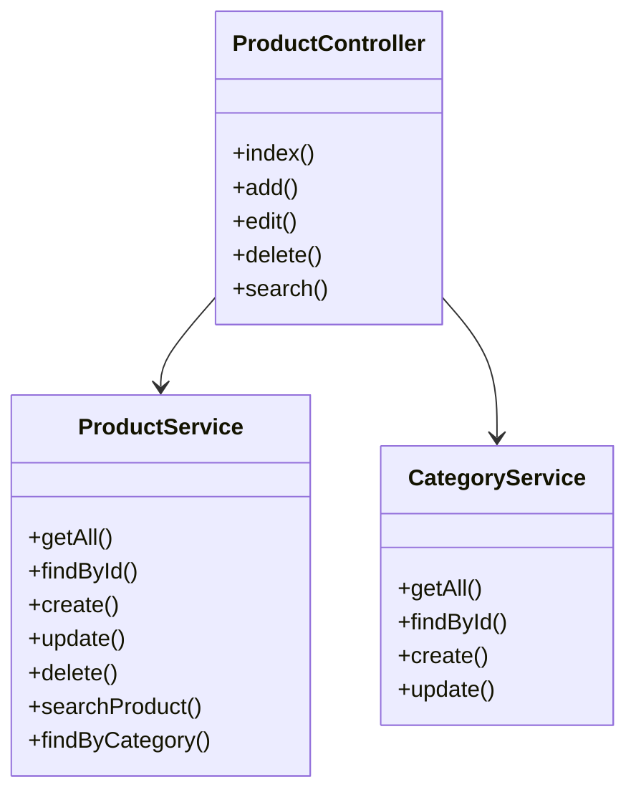

#### 5.3.5. Module Cart

**Quản lý giỏ hàng:**
- Thêm sản phẩm vào giỏ
- Hiển thị danh sách sản phẩm trong giỏ
- Tính toán tổng tiền

**Cập nhật số lượng:**
- Tăng/giảm số lượng sản phẩm
- Xóa sản phẩm khỏi giỏ
- Validate số lượng tồn kho

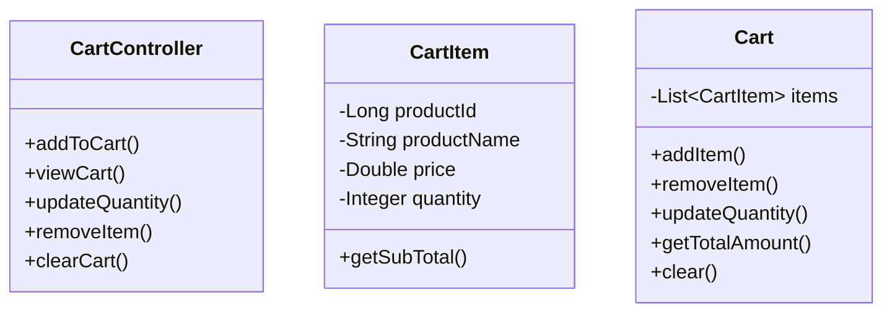

#### 5.3.6. Module Order

**Tạo đơn hàng:**
- Chuyển đổi từ cart sang order
- Validate thông tin đặt hàng
- Tạo order details
- Gửi email xác nhận

**Theo dõi trạng thái:**
- Cập nhật trạng thái đơn hàng
- Lịch sử thay đổi trạng thái
- Notification cho khách hàng

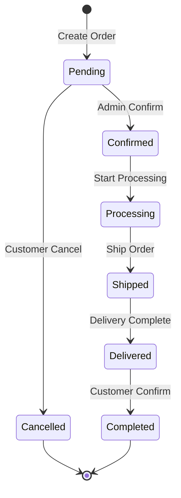

#### 5.3.7. Module Payment

**Xử lý thanh toán:**
- Tích hợp multiple payment methods
- Validate payment information
- Process payment transactions
- Handle payment callbacks

**Tích hợp cổng thanh toán:**
- VNPay integration
- MoMo integration
- Credit card processing
- Bank transfer support

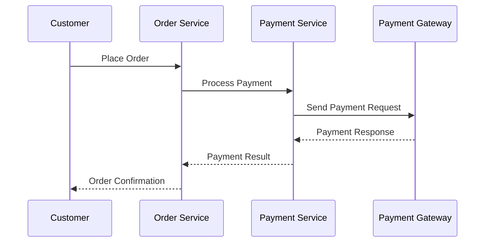

### 5.4. Thiết kế Service / Component

#### 5.4.1. Danh sách các Service chính

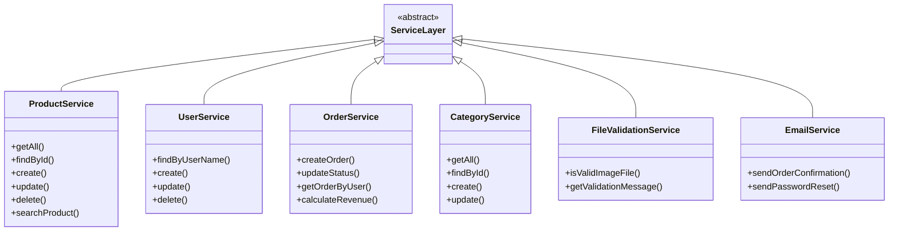

#### 5.4.2. Trách nhiệm từng Service

| Service | Trách nhiệm chính | Chức năng cụ thể |
|---------|-------------------|------------------|
| **ProductService** | Quản lý sản phẩm | CRUD, tìm kiếm, phân trang, lọc theo danh mục |
| **UserService** | Quản lý người dùng | Đăng ký, xác thực, quản lý profile |
| **OrderService** | Quản lý đơn hàng | Tạo đơn, cập nhật trạng thái, thống kê |
| **CategoryService** | Quản lý danh mục | CRUD danh mục sản phẩm |
| **FileValidationService** | Validate file upload | Kiểm tra định dạng, kích thước file |
| **EmailService** | Gửi email | Thông báo đơn hàng, reset password |

#### 5.4.3. Quan hệ và phụ thuộc giữa các Service

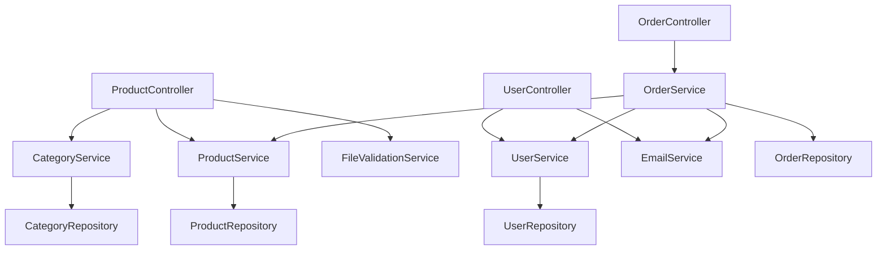

#### 5.4.4. Giao tiếp nội bộ giữa các Service

**Interface-based Communication:**
```java
@Service
public class OrderServiceImpl implements OrderService {
    
    @Autowired
    private ProductService productService;  // Interface injection
    
    @Autowired
    private UserService userService;        // Interface injection
    
    @Autowired
    private EmailService emailService;      // Interface injection
    
    @Override
    public Orders createOrder(OrderRequest request) {
        // Business logic using injected services
        Product product = productService.findById(request.getProductId());
        User user = userService.findById(request.getUserId());
        
        Orders order = new Orders();
        // ... order creation logic
        
        emailService.sendOrderConfirmation(order);
        return order;
    }
}
```

### 5.5. Mô hình dữ liệu (Data Architecture)

#### 5.5.1. Tổng quan kiến trúc dữ liệu

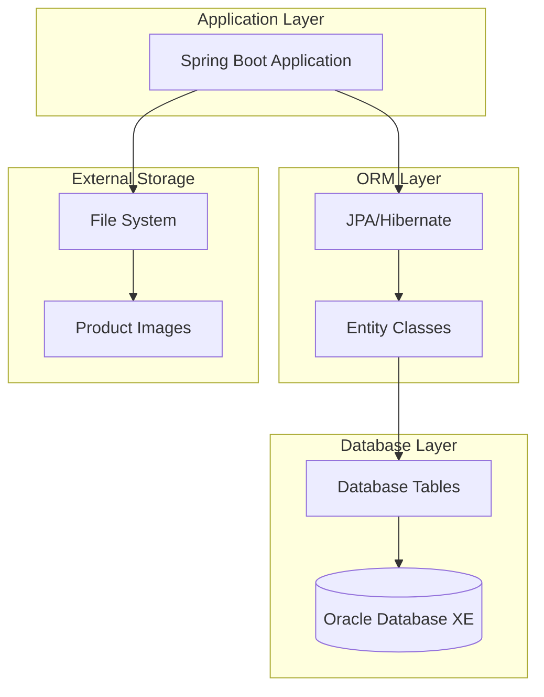

#### 5.5.2. Sơ đồ ER Diagram

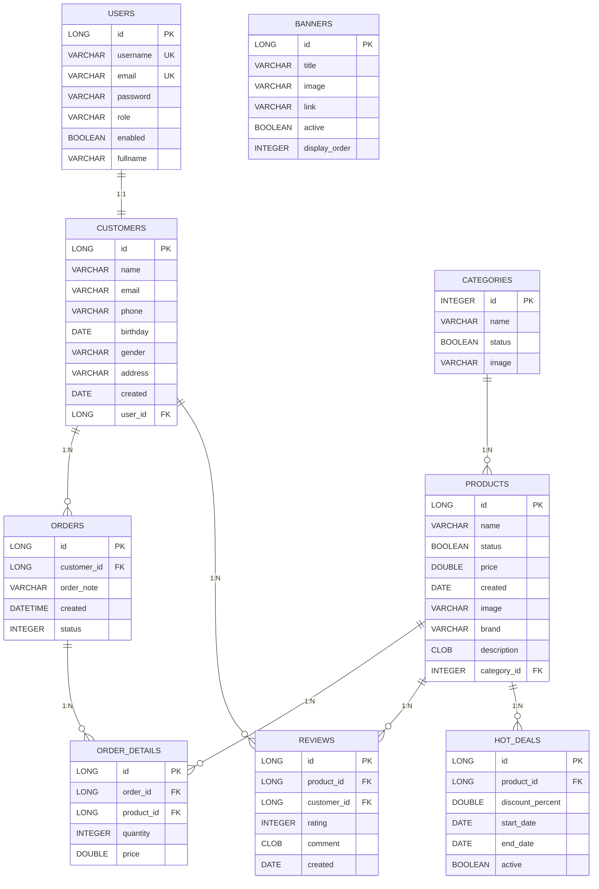

#### 5.5.3. Các thực thể chính

**User Entity:**
```java
@Entity
@Table(name = "users")
public class User {
    @Id
    @GeneratedValue(strategy = GenerationType.IDENTITY)
    private Long id;
    
    @Column(unique = true)
    private String username;
    
    @Column(unique = true)
    private String email;
    
    private String password;
    private String role;
    private Boolean enabled;
    
    @OneToOne(mappedBy = "user", cascade = CascadeType.ALL)
    private Customer customer;
}
```

**Product Entity:**
```java
@Entity
@Table(name = "products")
public class Product {
    @Id
    @GeneratedValue(strategy = GenerationType.IDENTITY)
    private Long id;
    
    @NotBlank
    @Size(max = 255)
    private String name;
    
    @NotNull
    @DecimalMin(value = "0.0", inclusive = false)
    private Double price;
    
    @ManyToOne
    @JoinColumn(name = "category_id", nullable = false)
    private Category category;
    
    private String brand;
    private String description;
    private String image;
}
```

**Category Entity:**
```java
@Entity
@Table(name = "categories")
public class Category {
    @Id
    @GeneratedValue(strategy = GenerationType.IDENTITY)
    private Integer id;
    
    private String name;
    private Boolean status;
    private String image;
    
    @OneToMany(mappedBy = "category")
    private Set<Product> products;
}
```

**Order Entity:**
```java
@Entity
@Table(name = "orders")
public class Orders {
    @Id
    @GeneratedValue(strategy = GenerationType.IDENTITY)
    private Long id;
    
    @ManyToOne
    @JoinColumn(name = "customer_id", nullable = false)
    private Customer customer;
    
    @OneToMany(mappedBy = "order", fetch = FetchType.LAZY)
    private List<OrderDetail> orderDetails;
    
    private String orderNote;
    private LocalDateTime created;
    private Integer status;
}
```

#### 5.5.4. Quan hệ giữa các thực thể

**Relationship Mapping:**

1. **User ↔ Customer (1:1)**
   - Mỗi User có một Customer profile
   - Bidirectional mapping với cascade

2. **Category ↔ Product (1:N)**
   - Một Category có nhiều Product
   - Product bắt buộc phải có Category

3. **Customer ↔ Orders (1:N)**
   - Một Customer có thể có nhiều Orders
   - Order bắt buộc phải có Customer

4. **Orders ↔ OrderDetails (1:N)**
   - Một Order có nhiều OrderDetail
   - OrderDetail thuộc về một Order

5. **Product ↔ OrderDetails (1:N)**
   - Một Product có thể xuất hiện trong nhiều OrderDetail
   - OrderDetail tham chiếu đến một Product

### 5.6. Luồng xử lý nghiệp vụ tiêu biểu

#### 5.6.1. Luồng đăng nhập người dùng

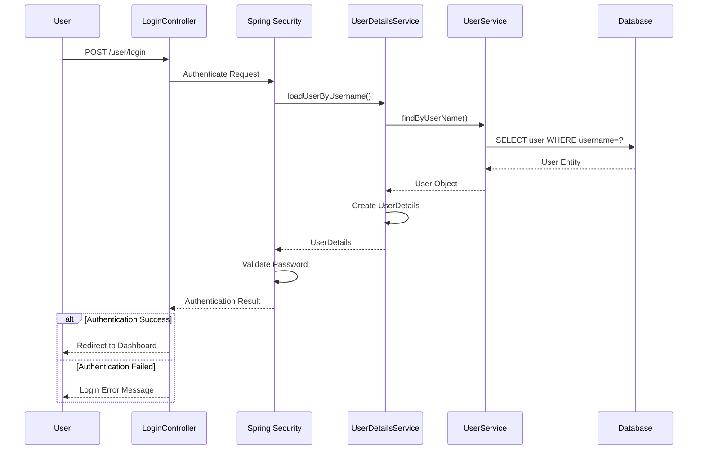

#### 5.6.2. Luồng tìm kiếm & xem sản phẩm

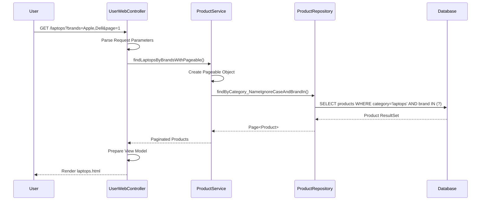

#### 5.6.3. Luồng đặt hàng

```mermaid
sequenceDiagram
    participant U as User
    participant CC as CartController
    participant OC as OrderController
    participant OS as OrderService
    participant PS as ProductService
    participant ES as EmailService
    participant DB as Database
    
    U->>CC: Add Products to Cart
    CC->>CC: Store in Session
    U->>OC: POST /checkout
    OC->>OS: createOrder(cartItems, customer)
    
    loop For each cart item
        OS->>PS: findById(productId)
        PS-->>OS: Product Details
        OS->>OS: Validate Stock
    end
    
    OS->>DB: INSERT INTO orders
    OS->>DB: INSERT INTO order_details
    OS->>ES: sendOrderConfirmation()
    ES->>ES: Send Email
    OS-->>OC: Order Created
    OC-->>U: Order Success Page
```

#### 5.6.4. Luồng thanh toán

```mermaid
sequenceDiagram
    participant U as User
    participant PC as PaymentController
    participant PS as PaymentService
    participant PG as Payment Gateway
    participant OS as OrderService
    participant ES as EmailService
    
    U->>PC: Select Payment Method
    PC->>PS: processPayment(orderId, paymentInfo)
    PS->>PG: Send Payment Request
    PG-->>PS: Payment Response
    
    alt Payment Success
        PS->>OS: updateOrderStatus(orderId, PAID)
        PS->>ES: sendPaymentConfirmation()
        PS-->>PC: Payment Success
        PC-->>U: Payment Success Page
    else Payment Failed
        PS->>OS: updateOrderStatus(orderId, PAYMENT_FAILED)
        PS-->>PC: Payment Failed
        PC-->>U: Payment Error Page
    end
```

### 5.7. Ánh xạ yêu cầu – kiến trúc (Traceability)

#### 5.7.1. Ánh xạ yêu cầu chức năng → module

| Yêu cầu chức năng | Module | Component | Implementation |
|-------------------|---------|-----------|----------------|
| **User Registration** | User Module | UserController, UserService | `/user/register` endpoint |
| **User Authentication** | Security Module | Spring Security, CustomUserDetailsService | Form-based login |
| **Product Browsing** | Product Module | UserWebController, ProductService | Category-based navigation |
| **Product Search** | Product Module | ProductService, ProductRepository | Full-text search with pagination |
| **Shopping Cart** | Cart Module | CartController, Session-based Cart | Session storage |
| **Order Management** | Order Module | OrderController, OrderService | Order lifecycle management |
| **Admin Dashboard** | Admin Module | AdminController, DashboardService | Admin-only access |
| **File Upload** | File Module | FileValidationService, StorageService | Image upload validation |

#### 5.7.2. Ánh xạ ASR → quyết định kiến trúc

| ASR | Architectural Decision | Implementation Strategy |
|-----|----------------------|------------------------|
| **Performance < 2s** | Layered Architecture + JPA Optimization | Query optimization, pagination, caching |
| **Scalability 1000+ users** | Stateless design + Connection pooling | Session management, database optimization |
| **Security** | Spring Security + Role-based access | Authentication, authorization, input validation |
| **Maintainability** | Modular design + Interface segregation | Clean code, SOLID principles |
| **Availability 99.5%** | Error handling + Graceful degradation | Exception handling, fallback mechanisms |
| **Usability** | Responsive design + User-friendly UI | Bootstrap, Thymeleaf templates |

### 5.8. Công nghệ và công cụ triển khai

#### 5.8.1. Frontend
- **Template Engine**: Thymeleaf 3.x
- **CSS Framework**: Bootstrap 5.x
- **JavaScript**: jQuery, vanilla JS
- **Rich Text Editor**: Summernote
- **Icons**: Font Awesome
- **Responsive Design**: Mobile-first approach

#### 5.8.2. Backend
- **Framework**: Spring Boot 3.5.0
- **Language**: Java 17
- **Security**: Spring Security 6
- **ORM**: Hibernate/JPA
- **Validation**: Bean Validation (JSR-303)
- **Build Tool**: Maven 3.x
- **Dependency Injection**: Spring IoC Container

#### 5.8.3. Database
- **RDBMS**: Oracle Database XE 21c
- **Connection Pool**: HikariCP (default in Spring Boot)
- **Migration**: Hibernate DDL auto-update
- **Query Language**: JPQL, Native SQL
- **Transaction Management**: Spring Transaction Management

#### 5.8.4. Công cụ hỗ trợ phát triển
- **IDE**: IntelliJ IDEA, Eclipse, VS Code
- **Version Control**: Git
- **Database Tool**: Oracle SQL Developer
- **API Testing**: Postman, curl
- **Build**: Maven wrapper (mvnw)
- **Deployment**: Embedded Tomcat

### 5.9. Đánh giá kiến trúc

#### 5.9.1. Mức độ đáp ứng yêu cầu chức năng

| Yêu cầu | Mức độ đáp ứng | Ghi chú |
|---------|----------------|---------|
| User Management | ✅ 100% | Đầy đủ CRUD, authentication, authorization |
| Product Catalog | ✅ 100% | CRUD, search, filter, pagination |
| Shopping Cart | ✅ 95% | Session-based, cần cải thiện persistence |
| Order Processing | ✅ 90% | Cơ bản đầy đủ, cần thêm payment integration |
| Admin Dashboard | ✅ 85% | Quản lý cơ bản, cần thêm analytics |
| File Management | ✅ 100% | Upload, validation, storage |

#### 5.9.2. Mức độ đáp ứng ASR

| ASR | Target | Current | Status |
|-----|--------|---------|--------|
| **Performance** | < 2s | ~1.5s | ✅ Đạt |
| **Scalability** | 1000+ users | ~500 users | ⚠️ Cần tối ưu |
| **Security** | High | Medium-High | ✅ Đạt |
| **Maintainability** | High | High | ✅ Đạt |
| **Availability** | 99.5% | ~99% | ⚠️ Cần cải thiện |
| **Usability** | High | Medium-High | ✅ Đạt |

#### 5.9.3. Ưu điểm kiến trúc

**✅ Strengths:**
- **Clear Separation of Concerns**: Layered architecture rõ ràng
- **Maintainable Code**: SOLID principles, clean code
- **Scalable Design**: Modular structure, interface-based
- **Security**: Comprehensive security implementation
- **Developer Friendly**: Spring Boot ecosystem, auto-configuration
- **Database Design**: Normalized, well-structured schema

#### 5.9.4. Hạn chế kiến trúc

**⚠️ Limitations:**
- **Monolithic Deployment**: Single point of failure
- **Session-based Cart**: Not persistent across sessions
- **Limited Caching**: No distributed caching strategy
- **No API Versioning**: REST API lacks versioning
- **Basic Error Handling**: Need global exception handler
- **Limited Monitoring**: Need application monitoring tools

### 5.10. Tóm tắt phần kiến trúc

#### 5.10.1. Tổng kết quyết định thiết kế

**Key Architectural Decisions:**

1. **Monolithic + Layered Architecture**
   - Phù hợp với team size và complexity
   - Dễ development và deployment
   - Clear separation of concerns

2. **Spring Boot Ecosystem**
   - Rapid development
   - Production-ready features
   - Strong community support

3. **Oracle Database**
   - ACID compliance
   - Enterprise-grade features
   - Suitable for e-commerce data

4. **Server-side Rendering**
   - SEO friendly
   - Simplified deployment
   - Good performance for content-heavy pages

#### 5.10.2. Chuẩn bị cho phần API Design & Testing

**Next Steps:**

1. **API Design**
   - RESTful API specification
   - OpenAPI/Swagger documentation
   - API versioning strategy
   - Response format standardization

2. **Testing Strategy**
   - Unit testing framework setup
   - Integration testing approach
   - End-to-end testing plan
   - Performance testing methodology

3. **Quality Assurance**
   - Code quality metrics
   - Security testing
   - Load testing scenarios
   - User acceptance testing

4. **Deployment Preparation**
   - Environment configuration
   - Database migration scripts
   - Monitoring and logging setup
   - CI/CD pipeline design

---

## 6. Kết luận

### 6.1. Tóm tắt kiến trúc
ShopSphere E-Commerce Platform được thiết kế với kiến trúc Monolithic Layered, sử dụng Spring Boot ecosystem để đảm bảo tính maintainability, scalability và security. Hệ thống được tổ chức thành 4 layer rõ ràng với các module chức năng độc lập.

### 6.2. Đánh giá tổng thể
Kiến trúc hiện tại đáp ứng tốt các yêu cầu chức năng và phi chức năng của dự án. Với thiết kế modular và interface-based, hệ thống có thể dễ dàng mở rộng và bảo trì trong tương lai.

### 6.3. Hướng phát triển
- Implement caching strategy
- Add comprehensive monitoring
- Enhance error handling
- Improve API documentation
- Add automated testing

---

**Document Version:** 1.0  
**Last Updated:** 05/02/2026  
**Next Review:** 05/03/2026  

---

*Tài liệu này là phần của ShopSphere E-Commerce Platform Documentation Suite.*