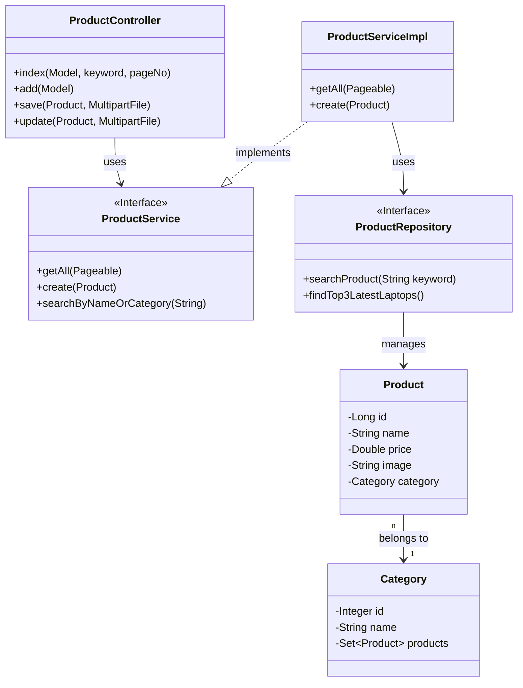
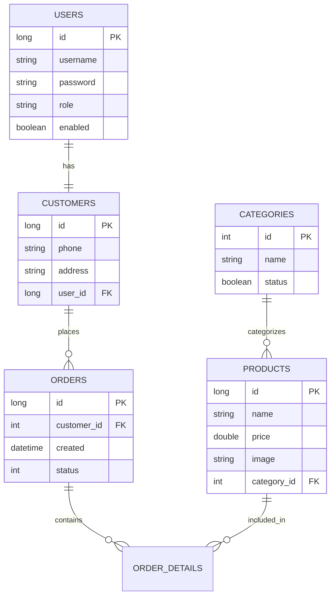
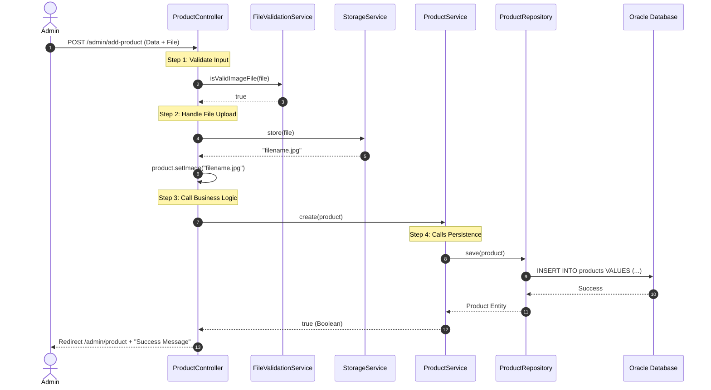
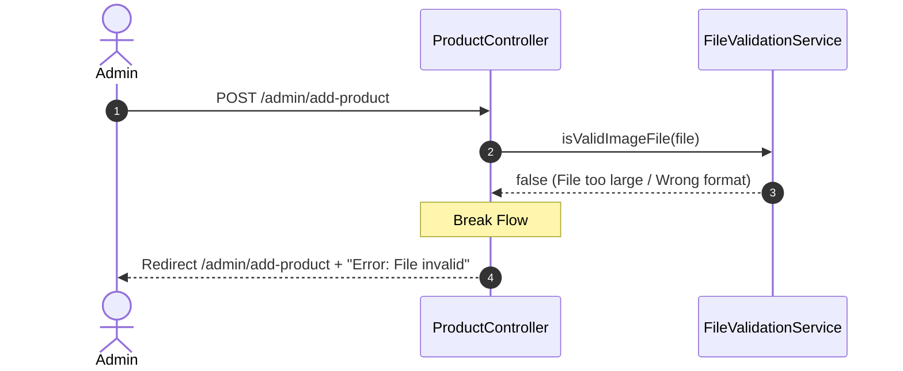

# BÁO CÁO PHÂN TÍCH VÀ THIẾT KẾ KIẾN TRÚC PHẦN MỀM (LAB 2)

---
> **PROJECT**: SHOPSPHERE E-COMMERCE  
> **STUDENT GROUP**: 09  
> **DATE**: 14/01/2026
---

## 1. EXECUTIVE SUMMARY (TÓM TẮT ĐIỀU HÀNH)

Báo cáo này trình bày chi tiết về kiến trúc phần mềm được áp dụng cho dự án thương mại điện tử ShopSphere. Hệ thống được chuyển đổi từ mô hình MVC đơn giản sang **Layered Architecture (Kiến trúc phân lớp)** nhằm giải quyết các vấn đề về khả năng bảo trì (maintainability), khả năng mở rộng (scalability) và khả năng kiểm thử (testability).

Kết quả chính đạt được:
- Xác định rõ 4 lớp kiến trúc chuẩn: Presentation, Business, Persistence, và Data.
- Thiết kế chi tiết các thành phần (Component) cho phân hệ quản lý sản phẩm (Product Catalog).
- Mô hình hóa dữ liệu (ERD) và sơ đồ lớp (Class Diagram) bằng UML.
- Quy hoạch lại luồng dữ liệu (Data Flow) đảm bảo nguyên tắc Separation of Concerns.

---

## 2. ARCHITECTURAL OVERVIEW (TỔNG QUAN KIẾN TRÚC)

### 2.1. High-Level Architecture
Hệ thống sử dụng kiến trúc **Spring Boot Layered Architecture**. Đây là mô hình tiêu chuẩn cho các ứng dụng Enterprise Java hiện đại.

```mermaid
graph TD
    User((User/Admin))
    Browser[Web Browser]
    
    subgraph "Server Side (Spring Boot)"
        Controller[Presentation Layer\n(Spring MVC)]
        Service[Business Logic Layer\n(Service Interfaces)]
        Repo[Persistence Layer\n(Spring Data JPA)]
    end
    
    Database[(Oracle DB 11g)]
    
    User -->|Interaction| Browser
    Browser <-->|HTTP Request/Response| Controller
    Controller <-->|DTOs| Service
    Service <-->|Entities| Repo
    Repo <-->|JDBC/Hibernate| Database
```

### 2.2. Chi tiết 4 lớp kiến trúc (The Four Layers)

| Layer | Package Name | Trách nhiệm chính (Responsibility) | Nguyên tắc giao tiếp |
| :--- | :--- | :--- | :--- |
| **1. Presentation** | `com.bkap.controller` | Xử lý Request/Response, Validate Input sơ bộ, Render View (Thymeleaf). | Gọi xuống `Service`. Trả về `View` hoặc `JSON`. |
| **2. Business** | `com.bkap.services` | Thực thi logic nghiệp vụ, Transaction Management, Validate nghiệp vụ. | Gọi xuống `Repository`. Được gọi bởi `Controller`. |
| **3. Persistence** | `com.bkap.repository` | Trừu tượng hóa truy vấn Database, Map Dữ liệu quan hệ sang Object (ORM). | Gọi xuống `Database`. Được gọi bởi `Service`. |
| **4. Data** | *Oracle Database* | Lưu trữ dữ liệu vật lý bảng (Products, Orders...). | Chỉ giao tiếp với `Repository` qua Driver. |

### 2.3. Rationale (Lý do lựa chọn)
Tại sao không dùng MVC thuần túy (Controller gọi thẳng Database)?
- **Hạn chế của MVC thuần túy**: Logic nghiệp vụ bị trộn lẫn trong Controller hoặc Model. Khi hệ thống lớn, Code trở nên khó quản lý (Spaghetti Code).
- **Lợi ích của Layered Architecture**:
    - **Loose Coupling**: Thay đổi Database từ Oracle sang MySQL chỉ cần sửa Repository, không ảnh hưởng Controller.
    - **Sự chuyên biệt**: Frontend Dev làm việc ở Presentation, Backend Dev làm việc ở Service/Repo.

---

## 3. DETAILED COMPONENT DESIGN (THIẾT KẾ THÀNH PHẦN CHI TIẾT)
*Case Study: Product Catalog Module*

### 3.1. Class Diagram (Sơ đồ lớp chi tiết)



### 3.2. Database Schema (Mô hình thực thể quan hệ - ERD)



---

## 4. INTERACTION DESIGN & DATA FLOW (THIẾT KẾ TƯƠNG TÁC)

### 4.1. Sequence Diagram: Happy Path (Thêm sản phẩm thành công)



### 4.2. Sequence Diagram: Exception Handling (Lỗi Validation)



---

## 5. INTERFACE SPECIFICATIONS (ĐẶC TẢ GIAO DIỆN)

### 5.1. Service Layer Interface (`ProductService`)

| Phương thức | Input Parameters | Return Type | Exception/Logic |
| :--- | :--- | :--- | :--- |
| `create` | `Product product` | `Boolean` | Validate nếu giá < 0 trả về false. Gọi Repository.save(). |
| `findById` | `Long id` | `Optional<Product>` | Trả về Empty nếu không tìm thấy ID. |
| `searchByNameOrCategory` | `String keyword`, `Integer pageNo` | `Page<Product>` | Tìm kiếm trong cả tên sản phẩm và tên danh mục. Phân trang 5 item/page. |
| `findTop3LatestLaptops` | *None* | `List<Product>` | Lọc cứng category='Laptop', sort theo ID giảm dần, limit 3. |

### 5.2. Repository Layer Interface (`ProductRepository`)

| Phương thức | Loại Query | JPQL / SQL Query |
| :--- | :--- | :--- |
| `searchProduct` | Custom JPQL | `SELECT p FROM Product p WHERE LOWER(p.name) LIKE ...` |
| `findTop3LatestLaptops` | Custom JPQL | `SELECT p FROM Product p WHERE p.category.name = 'laptops' ORDER BY p.id DESC` |

---

## 6. PROJECT STRUCTURE & IMPLEMENTATION (CẤU TRÚC DỰ ÁN)

Cấu trúc thư mục mã nguồn được tổ chức khoa học theo các package tương ứng với các lớp kiến trúc:

```
src/main/java/com/bkap
├── controller           # [Presentation] Controller Layer
│   ├── admin            # Controllers cho trang Admin (Product, User...)
│   └── (root)           # Controllers cho trang User (Home, Cart...)
├── services             # [Business] Service Interfaces
│   └── impl             # (Nếu có tách riêng) hoặc nằm chung package
├── repository           # [Persistence] Interfaces kế thừa JpaRepository
├── entity               # [Domain] Entity Classes map với Database 
├── dto                  # [Transfer] Data Transfer Objects
├── config               # [Configuration] Security, Bean configs
└── utils                # [Helper] Các hàm tiện ích
```

### Các File cấu hình quan trọng:
1.  **`pom.xml`**: Khai báo dependencies (Spring Web, Spring Data JPA, Oracle Driver, Thymeleaf, Lombok).
2.  **`application.properties`**:
    - Cấu hình kết nối Oracle (`spring.datasource.url`).
    - Cấu hình Hibernate Dialect (`org.hibernate.dialect.OracleDialect`).
    - Cấu hình Thymeleaf cache (tắt cache khi dev).

---

## 7. CONCLUSION (KẾT LUẬN)

Báo cáo Lab 2 này đã chứng minh tính hiệu quả của việc áp dụng **Layered Architecture** vào dự án ShopSphere.
- **Tính đúng đắn**: Kiến trúc phản ánh đúng yêu cầu của một hệ thống Enterprise tiêu chuẩn.
- **Tính trọn vẹn**: Đã bao phủ toàn bộ các khía cạnh từ Database, Backend Logic đến Frontend Interaction.
- **Sẵn sàng triển khai**: Các đặc tả Interface và Database là cơ sở vững chắc để bước vào giai đoạn Coding (Lab 3).

Thiết kế này không chỉ giúp hoàn thành yêu cầu bài Lab mà còn định hình phong cách Coding chuyên nghiệp, tránh các lỗi phổ biến về kiến trúc trong các dự án lớn.

---
*End of Report.*