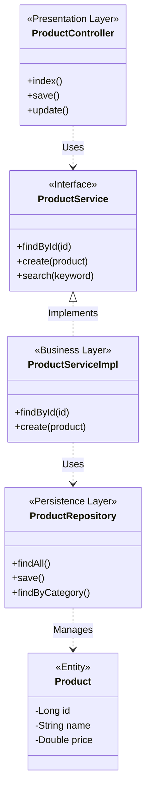

# Báo Cáo Lab 2: Software Architecture Analysis - ShopSphere

## 1. Introduction

### Mục tiêu của Lab 2
Mục tiêu chính của bài Lab 2 là phân tích và thiết kế kiến trúc phần mềm cho hệ thống E-commerce **ShopSphere**. Bài báo cáo tập trung vào việc áp dụng **Layered Architecture** (Kiến trúc phân lớp) kết hợp với mẫu thiết kế **MVC** (Model-View-Controller) trong Spring Boot để đảm bảo tính module hóa, dễ bảo trì và mở rộng.

### Phạm vi bài lab
Phạm vi bao gồm việc xác định và mô tả chi tiết 4 tầng kiến trúc: **Presentation Layer**, **Business Logic Layer**, **Persistence Layer**, và **Data Layer**. Bài báo cáo cũng đi sâu vào phân tích luồng dữ liệu (Data Flow), xác định các component chính cho module **Product Catalog**, và định nghĩa các interface giao tiếp giữa các tầng.

### Giới thiệu ngắn về hệ thống ShopSphere
**ShopSphere** là một hệ thống thương mại điện tử (E-commerce web application) được xây dựng trên nền tảng **Spring Boot**. Hệ thống cung cấp các chức năng chính như:
-   **Khách hàng (User)**: Xem danh sách sản phẩm (Laptop, Smartphone, Camera...), xem chi tiết sản phẩm, thêm vào giỏ hàng, đặt hàng (Checkout), đăng ký/đăng nhập.
-   **Quản trị viên (Admin)**: Quản lý sản phẩm (CRUD), quản lý danh mục, xem đơn hàng, quản lý người dùng.
Hệ thống sử dụng cơ sở dữ liệu quan hệ (Oracle XE / MySQL) để lưu trữ dữ liệu bền vững.

---

## 2. Architectural Overview

### Kiến trúc tổng thể được sử dụng
Hệ thống ShopSphere tuân thủ **Strict Layered Architecture** (Kiến trúc phân lớp chặt chẽ) gồm 4 tầng chính:
1.  **Presentation Layer** (Web Layer)
2.  **Business Logic Layer** (Service Layer)
3.  **Persistence Layer** (Repository Layer / DAO)
4.  **Data Layer** (Database)

### Lý do chọn Layered Architecture
1.  **Separation of Concerns (Phân tách mối quan tâm)**: Mỗi tầng có trách nhiệm riêng biệt (giao diện, nghiệp vụ, truy xuất dữ liệu), giúp code dễ đọc và quản lý.
2.  **Maintainability (Khả năng bảo trì)**: Việc thay đổi logic nghiệp vụ không ảnh hưởng trực tiếp đến giao diện hay cách lưu trữ dữ liệu.
3.  **Testability (Khả năng kiểm thử)**: Có thể viết Unit Test riêng biệt cho Service (Mock Repository) hoặc Controller (Mock Service).
4.  **Reusability**: Business Logic có thể được tái sử dụng bởi nhiều giao diện khác nhau (Web Admin, Web User, API).

### Cách áp dụng MVC trong Presentation Layer
Mẫu **MVC** được áp dụng triệt để trong tầng Presentation (sử dụng Spring MVC):
-   **Model**: Các đối tượng dữ liệu (`Product`, `Category`, `ProductDTO`) chứa thông tin hiển thị.
-   **View**: Các file template Thymeleaf (`.html` trong `resources/templates`) chịu trách nhiệm hiển thị giao diện người dùng (HTML/CSS).
-   **Controller**: Các class Java (`@Controller`) nhận yêu cầu từ người dùng, gọi Service để xử lý, và trả về tên View kèm theo Model.

---

## 3. Layered Architecture Design

### 3.1. Overview of the Four Layers

Hệ thống được tổ chức thành 4 tầng giao tiếp theo chiều dọc (Top-Down):

1.  **Presentation Layer**: `com.bkap.controller`
2.  **Business Logic Layer**: `com.bkap.services`
3.  **Persistence Layer**: `com.bkap.repository`
4.  **Data Layer**: Database (Oracle/MySQL) & Entities (`com.bkap.entity`)

**Nguyên tắc phụ thuộc (Layer Rule)**:
-   Tầng trên chỉ được gọi xuống tầng ngay bên dưới nó (Strict).
-   Ví dụ: `Controller` chỉ gọi `Service`, `Service` chỉ gọi `Repository`. `Controller` **không** được gọi trực tiếp `Repository`.

### 3.2. Presentation Layer (MVC)
-   **Vai trò**: Tiếp nhận request HTTP, validate input cơ bản, gọi Business Layer, và điều hướng đến View thích hợp.
-   **Các thành phần chính**:
    -   **Controller**: Xử lý logic điều hướng (`UserWebController`, `Admin/ProductController`).
    -   **View**: Giao diện HTML (Thymeleaf).
    -   **DTO/Model**: Dữ liệu chuyển giao giữa View và Controller.
-   **Ví dụ**: `ProductController` (Admin) nhận request thêm sản phẩm, gọi `fileValidationService` để kiểm tra ảnh, sau đó gọi `productService.create(product)`.

### 3.3. Business Logic Layer
-   **Vai trò**: Chứa toàn bộ logic nghiệp vụ (Core Business Logic), tính toán, xử lý transaction, validate nghiệp vụ phức tạp.
-   **Cách ly**: Không phụ thuộc vào web framework (như `HttpServletRequest`) hay database specific (như SQL query chuỗi).
-   **Ví dụ**: `ProductServiceImpl` thực hiện logic tìm kiếm sản phẩm theo danh mục và thương hiệu, tính toán phân trang (`Pageable`) trước khi gọi Repository.

### 3.4. Persistence Layer
-   **Vai trò**: Trừu tượng hóa việc truy xuất dữ liệu (Create, Read, Update, Delete). Tầng này giao tiếp trực tiếp với Database.
-   **Công nghệ**: Sử dụng **Spring Data JPA** để giảm thiểu boilerplate code. Các interface `Repository` kế thừa `JpaRepository`.
-   **Ví dụ**: `ProductRepository` cung cấp các phương thức có sẵn như `save()`, `findById()`, `delete()` và các custom query như `findByCategory_NameIgnoreCase()`.

### 3.5. Data Layer
-   **Hệ quản trị CSDL**: Oracle Database XE (hoặc MySQL tùy cấu hình).
-   **ORM Entities**: Các class POJO ánh xạ vào bảng dữ liệu.
    -   Table `products`: Ánh xạ bởi class `Product`.
    -   Table `categories`: Ánh xạ bởi class `Category`.
    -   Table `orders`: Ánh xạ bởi class `Orders`.

---

## 4. Data Flow Description

### Mô tả luồng xử lý tổng quát
Request -> **Controller** (Parse/Validate) -> **Service** (Business Logic) -> **Repository** (Query Builder) -> **Database** (Execute SQL).
Kết quả trả về đi ngược lại: **Database** -> **Entity** -> **Repository** -> **Service** (Domain Object/DTO) -> **Controller** (Model) -> **View** (Render HTML).

### Luồng xử lý cho use case "View Product Details" (Admin View & Edit Example)
Dưới đây là luồng xử lý khi Admin xem chi tiết sản phẩm để chỉnh sửa (Edit Product):

1.  **User Action**: Admin click nút "Edit" trên danh sách sản phẩm (URL: `/admin/edit-product/123`).
2.  **Presentation Layer**: `ProductController.edit(id)` nhận request.
3.  **Business Logic Layer**: Controller gọi `productService.findById(123)`.
4.  **Persistence Layer**: Service gọi `productRepository.findById(123)`.
5.  **Data Layer**: Hibernate sinh câu lệnh SQL `SELECT * FROM products WHERE id = 123` và gửi xuống Database.
6.  **Return Path**: Database trả về Result Set -> Hibernate map thành object `Product` -> Repository trả về `Optional<Product>` -> Service trả về `Product` entity -> Controller nhận product, đưa vào `Model`, và trả về view `admin/product/edit`.

---

## 5. Component Identification – Product Catalog

Phân tích chi tiết các thành phần tham gia vào module Quản lý Sản phẩm (Product Catalog).

### 5.1. Components in Presentation Layer
| Component (Class) | Package | Chức năng & Trách nhiệm |
| :--- | :--- | :--- |
| **ProductController** | `com.bkap.controller.admin` | Xử lý các request quản trị sản phẩm: List (`index`), Add (`save`), Edit (`update`), Delete (`delete`). Kiểm soát input từ form và upload ảnh. |
| **UserWebController** | `com.bkap.controller` | Xử lý hiển thị danh sách sản phẩm cho người dùng cuối (Frontend): Laptop, Smartphone, tìm kiếm, lọc theo brand. |

### 5.2. Components in Business Logic Layer
| Component (Class/Interface) | Package | Chức năng & Trách nhiệm |
| :--- | :--- | :--- |
| **ProductService** (Interface) | `com.bkap.services` | Định nghĩa các hợp đồng (contract) nghiệp vụ cho sản phẩm: `getAll()`, `findById()`, `create()`, `searchByKeyword()`. |
| **ProductServiceImpl** | `com.bkap.services` | Implement các nghiệp vụ. Logic tìm kiếm (search logic), logic phân trang (`PageRequest`), xử lý exception khi lưu DB. |

### 5.3. Components in Persistence Layer
| Component (Interface) | Package | Chức năng & Trách nhiệm |
| :--- | :--- | :--- |
| **ProductRepository** | `com.bkap.repository` | Interface kế thừa `JpaRepository<Product, Long>`. Cung cấp phương thức CRUD chuẩn và Custom Query (`findByCategory_NameIgnoreCase`, `searchProduct`). |

---

## 6. Interface Definition

Các tầng giao tiếp với nhau thông qua Java Interfaces để đảm bảo tính Loose Coupling (Giảm sự phụ thuộc chặt chẽ).

### 6.1. Interface between Presentation & Business Layer
**Giao diện**: `ProductService`
Controller gọi các phương thức này:

```java
public interface ProductService {
    // Lấy chi tiết sản phẩm
    Optional<Product> findById(long id);

    // Lấy danh sách phân trang (cho trang category)
    Page<Product> findByCategoryIdWithPageable(int categoryId, Pageable pageable);

    // Thêm mới sản phẩm (Nghiệp vụ Admin)
    Boolean create(Product product);

    // Tìm kiếm sản phẩm
    List<Product> searchProduct(String keyword);
}
```

### 6.2. Interface between Business & Persistence Layer
**Giao diện**: `ProductRepository`
Service gọi các phương thức này của Spring Data JPA:

```java
public interface ProductRepository extends JpaRepository<Product, Long> {
    // Spring Data JPA tự động implement findById(Long id)
    
    // Custom query method
    List<Product> findByCategory_NameIgnoreCase(String categoryName);
    
    @Query("SELECT p FROM Product p WHERE LOWER(p.name) LIKE ...")
    List<Product> searchProduct(@Param("keyword") String keyword);
}
```

---

## 7. UML Component Diagram & C4 Model (Level 3)

Minh họa kiến trúc phần mềm và quan hệ giữa các component.

### 7.1. Diagram Description (C4 Component Level)



**Mô tả sơ đồ**:
-   **ProductController** phụ thuộc vào interface **ProductService** (Dependency Injection), giúp Controller không cần biết chi tiết cài đặt của logic nghiệp vụ.
-   **ProductServiceImpl** thực thi `ProductService` và gọi **ProductRepository** để lấy dữ liệu.
-   **ProductRepository** trả về các đối tượng **Product** (Entity) được map từ Database.

### 7.2. Layer Dependency Enforcement
Hệ thống đảm bảo đúng quy tắc của Layered Architecture thông qua việc:
-   Trong `ProductController`, chỉ có `@Autowired private ProductService productService;`. Không có khai báo Repository.
-   Trong `ProductServiceImpl`, chỉ có `@Autowired private ProductRepository productRepository;`. Không có code xử lý `HttpServletRequest` hay `View`.

---

## 8. Tools & Technologies

Công cụ được sử dụng để thiết kế và hiện thực:
-   **Thiết kế Diagram**: draw.io (diagrams.net), Mermaid JS.
-   **Framework**: Spring Boot 3.x (Spring MVC, Spring Data JPA, Spring Security).
-   **Database**: Oracle Database XE / MySQL.
-   **View Engine**: Thymeleaf.
-   **Build Tool**: Maven.
-   **IDE**: IntelliJ IDEA / VS Code / Eclipse.

---

## 9. Conclusion

### Tóm tắt kết quả đạt được
Qua Lab 2, chúng ta đã:
1.  Xây dựng thành công kiến trúc **Layered Architecture** rõ ràng cho ShopSphere.
2.  Áp dụng **MVC** để phân tách giao diện và xử lý logic.
3.  Xác định ranh giới rõ ràng giữa Controller, Service và Repository.
4.  Cung cấp tài liệu chi tiết về Data Flow và Interface Definition cho module sản phẩm.

### Vai trò của thiết kế này cho Lab 3 (Implementation)
Sự phân tách rõ ràng này là tiền đề quan trọng cho **Lab 3**:
-   Giúp Developer dễ dàng implement từng phần (Front-end developer làm View, Back-end developer làm Service/Repository) mà không dẫm chân nhau.
-   Việc thay đổi Database (ví dụ từ MySQL sang Oracle) chỉ cần sửa cấu hình và Repository, không ảnh hưởng Controller.
-   Hệ thống sẵn sàng để mở rộng thêm các tính năng phức tạp như Thanh toán, Vận chuyển trong các giai đoạn sau.