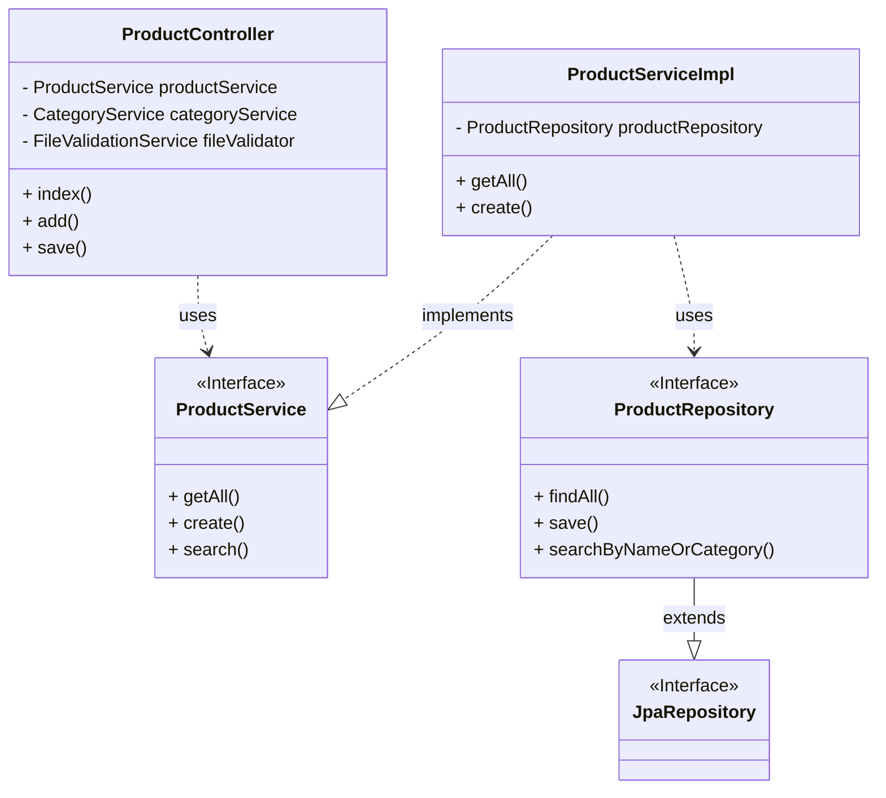

# BÁO CÁO PHÂN TÍCH VÀ THIẾT KẾ KIẾN TRÚC HỆ THỐNG (LAB 2)

## 1. Introduction (Giới thiệu)

### 1.1. Mục tiêu của Lab 2
Mục tiêu cốt lõi của bài Lab là chuyển đổi tư duy phát triển từ cách viết code "All-in-One" hoặc "Spaghetti code" sang **Layered Architecture (Kiến trúc phân lớp)** bài bản. Cụ thể:
- Hiểu và áp dụng mô hình phân tách trách nhiệm (Separation of Concerns).
- Thiết kế các thành phần (Component) độc lập, lỏng lẻo (loose coupling).
- Xây dựng tài liệu thiết kế chi tiết để làm cơ sở cho giai đoạn cài đặt (Implementation - Lab 3).

### 1.2. Phạm vi bài lab
- Phân tích kiến trúc tổng thể của Project.
- Thiết kế chi tiết cho module **Product Catalog** (Quản lý sản phẩm).
- Đi sâu vào thiết kế của 4 lớp: Presentation, Business Logic, Persistence, và Data Layer.
- Mô tả luồng dữ liệu (Data Flow) và các giao diện (Interface).

### 1.3. Giới thiệu hệ thống ShopSphere
**ShopSphere** là hệ thống thương mại điện tử B2C (Business to Consumer).
- **Công nghệ lõi**: Java Spring Boot 3.5.0.
- **Mô hình**: Server-side Rendering với Thymeleaf.
- **Chức năng chính**: Quản lý bán hàng cho các sản phẩm công nghệ.
- **Đối tượng sử dụng**:
    - **Admin**: Quản trị viên hệ thống (CRUD sản phẩm, đơn hàng).
    - **Customer**: Người mua hàng (Xem, tìm kiếm, đặt hàng).

---

## 2. Architectural Overview (Tổng quan kiến trúc)

### 2.1. Kiến trúc tổng thể
Hệ thống sử dụng **Layered Architecture** kết hợp với **MVC Pattern**. Đây là kiến trúc tiêu chuẩn cho các ứng dụng Enterprise Java, đảm bảo tính ổn định và khả năng mở rộng.

**Sơ đồ khối kiến trúc:**
```mermaid
graph TD
    Client[Client Browser] <-->|HTTP/HTTPS| Presentation[Presentation Layer\n(Controller + View)]
    Presentation <-->|DTO/Model| Business[Business Logic Layer\n(Service)]
    Business <-->|Entity| Persistence[Persistence Layer\n(Repository)]
    Persistence <-->|SQL| Database[Data Layer\n(Oracle DB)]
```

### 2.2. Lý do chọn Layered Architecture
1.  **Tính độc lập (Isolation)**: Thay đổi logic tính toán giá sản phẩm ở `Service` không làm ảnh hưởng đến câu lệnh SQL ở `Repository` hay giao diện ở `Controller`.
2.  **Tính bảo mật (Security)**: `Controller` không bao giờ được phép truy cập trực tiếp Database. Mọi truy xuất phải qua lớp `Service` kiểm soát quyền và validation.
3.  **Khả năng kiểm thử (Testability)**: Có thể viết Unit Test cho `ProductService` bằng cách giả lập (Mock) `ProductRepository`, không cần kết nối DB thật.

### 2.3. Áp dụng MVC trong Presentation Layer
Mô hình MVC chỉ nằm gọn trong lớp Presentation, đóng vai trò giao diện tương tác:
- **Model**: Dữ liệu truyền tải (`Product`, `Category`...).
- **View**: Giao diện HTML (`templates/admin/product/*.html`).
- **Controller**: Bộ điều phối (`ProductController`).

---

## 3. Layered Architecture Design (Chi tiết thiết kế phân lớp)

### 3.1. Overview of the Four Layers
Hệ thống tuân thủ nghiêm ngặt quy tắc "Downward Dependency" (Phụ thuộc chiều xuống):
`Controller` -> `Service` -> `Repository`.

### 3.2. Presentation Layer
- **Vai trò**: Cổng giao tiếp với người dùng.
- **Nhiệm vụ chính**:
    1.  Nhận HTTP Request (GET, POST...).
    2.  Validate dữ liệu đầu vào (Form validation).
    3.  Gọi Service để xử lý nghiệp vụ.
    4.  Chọn View để hiển thị kết quả.
- **Thành phần**: Spring MVC Controllers.

### 3.3. Business Logic Layer (Service Layer)
- **Vai trò**: "Bộ não" của hệ thống.
- **Nhiệm vụ chính**:
    1.  Thực thi logic nghiệp vụ (Ví dụ: Kiểm tra tồn kho trước khi đặt hàng).
    2.  Validate nghiệp vụ (Ví dụ: Giá bán > Giá nhập).
    3.  Quản lý Transaction (Đảm bảo tính toàn vẹn dữ liệu).
    4.  Điều phối các Repository (Ví dụ: Lưu Product xong phải lưu Image).
- **Thành phần**: Service Interfaces & Implementations.

### 3.4. Persistence Layer (Repository Layer)
- **Vai trò**: Cầu nối dữ liệu.
- **Nhiệm vụ chính**:
    1.  Thực hiện các câu lệnh CRUD.
    2.  Map dữ liệu từ bảng (Relational) sang Object (OOP).
- **Thành phần**: Spring Data JPA Repositories (Interfaces).

### 3.5. Data Layer
- **Hệ quản trị**: Oracle Database 11g Express Edition (XE).
- **Cấu hình**:
    - Driver: `oracle.jdbc.OracleDriver`.
    - Dialect: `org.hibernate.dialect.OracleDialect` (Tương thích tốt với Oracle).
    - Port: `1521`.

---

## 4. Component Identification – Product Catalog (Phân tích chi tiết Module Sản phẩm)

### 4.1. Presentation Layer Component: `ProductController`
- **Package**: `com.bkap.controller.admin`
- **Dependencies**:
    - `ProductService`: Xử lý CRUD sản phẩm.
    - `CategoryService`: Lấy danh sách danh mục cho dropdown.
    - `FileValidationService`: Validate file ảnh upload.
    - `StorageService`: Lưu file ảnh xuống ổ cứng.
- **Các API chính**:
    - `GET /admin/product`: Hiển thị danh sách, tìm kiếm.
    - `GET /admin/add-product`: Hiển thị form thêm.
    - `POST /admin/add-product`: Xử lý thêm mới.

### 4.2. Business Object Component: `ProductService` & `ProductServiceImpl`
- **Package**: `com.bkap.services`
- **Dependencies**: `ProductRepository`.
- **Chức năng nghiệp vụ**:
    - **Validation**: Không có logic phức tạp trong bài Lab này, chủ yếu gọi Repository.
    - **Paging**: Tính toán logic phân trang (`PageRequest`).
    - **Business Rules**:
        - `findTop3LatestLaptops`: Logic lấy 3 laptop mới nhất để hiển thị slide.
        - `searchByNameOrCategory`: Logic tìm kiếm thông minh kết hợp.

### 4.3. Persistence Component: `ProductRepository`
- **Package**: `com.bkap.repository`
- **Inheritance**: `JpaRepository<Product, Long>`.
- **Custom Queries**:
    ```java
    @Query("SELECT p FROM Product p WHERE LOWER(p.name) LIKE LOWER(CONCAT('%', :keyword, '%'))")
    List<Product> searchProduct(@Param("keyword") String keyword);
    ```
    *(Sử dụng JPQL để query độc lập với Database Engine)*

### 4.4. Helper Services
- **`FileValidationService`**:
    - Rule 1: Chỉ chấp nhận đuôi `.jpg`, `.jpeg`, `.png`, `.gif`.
    - Rule 2: Kích thước file tối đa 5MB.
    - Rule 3: Bắt buộc có file khi tạo mới, tùy chọn khi update.

---

## 5. Data Flow Description (Mô tả luồng dữ liệu)

### 5.1. Luồng 1: View Product List (Xem danh sách sản phẩm)
**Mô tả**: Admin vào trang quản lý sản phẩm.

```mermaid
sequenceDiagram
    actor Admin
    participant PC as ProductController
    participant PS as ProductService
    participant PR as ProductRepository
    participant DB as Oracle Database
    
    Admin->>PC: GET /admin/product
    PC->>PS: getAll(pageNo=1)
    PS->>PR: findAll(PageRequest.of(0, 5))
    PR->>DB: SELECT * FROM products OFFSET 0 ROWS FETCH NEXT 5 ROWS ONLY
    DB-->>PR: ResultSet (5 products)
    PR-->>PS: Page&lt;Product&gt;
    PS-->>PC: Page&lt;Product&gt;
    PC-->>Admin: Return HTML (admin/product/index.html)
```

### 5.2. Luồng 2: Create New Product (Thêm mới sản phẩm)
**Mô tả**: Admin submit form thêm sản phẩm kèm file ảnh.

1.  **Request**: Admin gửi POST request với form data (`name`, `price`...) và file (`imageFile`).
2.  **Controller Validation**:
    - `ProductController` gọi `FileValidationService.isValidImageFile(file)`.
    - Nếu sai (file > 5MB hoặc sai định dạng) -> Trả về lỗi ngay lập tức.
3.  **File Processing**:
    - Nếu validate OK, gọi `StorageService.store(file)` -> Lưu file vào thư mục `/uploads`.
    - Lấy tên file trả về gán vào `product.setImage(fileName)`.
4.  **Business Processing**:
    - Controller gọi `ProductService.create(product)`.
5.  **Persistence**:
    - Service gọi `ProductRepository.save(product)`.
    - Hibernate sinh SQL `INSERT INTO products VALUES (...)` gửi xuống DB.
6.  **Response**: Redirect về trang danh sách kèm thông báo "Thêm thành công".

---

## 6. Interface Definition (Định nghĩa giao diện)

Việc sử dụng Interface là bắt buộc trong Layered Architecture để đảm bảo tính Loose Coupling.

### 6.1. Interface: `ProductService`
Giao tiếp giữa Controller và Business Layer.

| Method Signature | Input | Output | Mô tả |
| :--- | :--- | :--- | :--- |
| `getAll(Integer pageNo)` | Số trang | `Page<Product>` | Lấy danh sách sản phẩm theo trang (Admin). |
| `searchByNameOrCategory` | Keyword, PageNo | `Page<Product>` | Tìm kiếm sản phẩm theo tên hoặc danh mục. |
| `create(Product p)` | Object Product | `Boolean` | Tạo mới sản phẩm. Return true nếu thành công. |
| `update(Product p)` | Object Product | `Boolean` | Cập nhật thông tin sản phẩm. |
| `delete(Long id)` | Product ID | `Boolean` | Xóa sản phẩm theo ID. |
| `findTop3LatestLaptops` | _None_ | `List<Product>` | Lấy 3 laptop mới nhất cho trang chủ User. |

### 6.2. Interface: `ProductRepository`
Giao tiếp giữa Service và Persistence Layer.

| Method Signature | Loại Query | Mô tả |
| :--- | :--- | :--- |
| `findAll(Pageable p)` | Built-in JPA | Tự động sinh query phân trang. |
| `save(Product p)` | Built-in JPA | Tự động sinh `INSERT` hoặc `UPDATE`. |
| `searchProduct` | **Custom JPQL** | Query tìm kiếm theo tên (Like search). |
| `findByCategory_Name` | **Derived Query** | Spring Data tự parse tên hàm thành query SQL tìm theo Category Name. |

---

## 7. UML Component Diagram

Dưới đây là sơ đồ thành phần chi tiết thể hiện sự phụ thuộc giữa các class.



### Giải thích Layer Dependency Enforcement:
- `ProductController` chỉ giữ tham chiếu đến `ProductService` (Interface). Nó **không biết** về `ProductServiceImpl` hay `ProductRepository`. Điều này cho phép ta thay thế implementation của Service mà không cần sửa code Controller.
- `ProductServiceImpl` giữ tham chiếu đến `ProductRepository`. Nó không biết về Database cụ thể (Oracle hay MySQL), chỉ biết Repository interface.

---

## 8. Tools & Technologies (Công cụ & Công nghệ)

| Công cụ / Công nghệ | Vai trò | Chi tiết |
| :--- | :--- | :--- |
| **Spring Boot 3.5.0** | Framework chính | Cung cấp Container, Dependency Injection, Auto Configuration. |
| **Spring Data JPA** | Persistence | Giảm thiểu code boilerplate cho tầng dữ liệu. Tự động implement Repository. |
| **Thymeleaf** | View Engine | Render HTML phía server, tích hợp chặt chẽ với Spring MVC. |
| **Oracle Ex 11g** | Database | Hệ quản trị CSDL quan hệ mạnh mẽ. |
| **Draw.io** | Design Tool | Vẽ sơ đồ UML, Flowchart. |
| **Maven** | Build Tool | Quản lý thư viện phụ thuộc (dependencies) trong `pom.xml`. |

---

## 9. Conclusion (Kết luận)

Báo cáo này đã cung cấp cái nhìn toàn diện và chi tiết về thiết kế kiến trúc của hệ thống ShopSphere cho Lab 2.
- **Tính khoa học**: Thiết kế tuân thủ các nguyên lý công nghệ phần mềm hiện đại (SOLID, Separation of Concerns).
- **Tính thực tiễn**: Các thành phần được map trực tiếp với Code thực tế trong dự án (`Controller`, `Service`, `Repository`).
- **Sẵn sàng cho Lab 3**: Với tài liệu này, việc implement các chức năng tiếp theo sẽ trở nên rõ ràng, giảm thiểu rủi ro lỗi thiết kế.

*Người thực hiện báo cáo: Kiro (AI Assistant)*